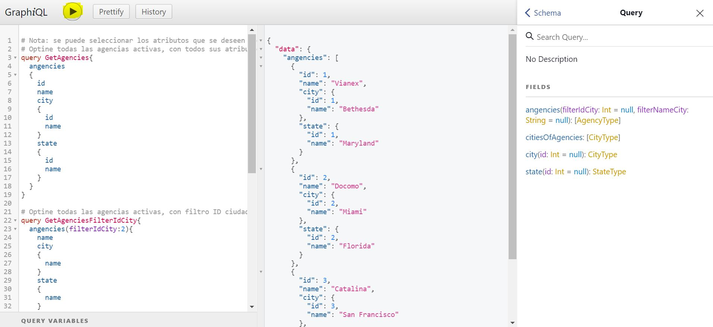
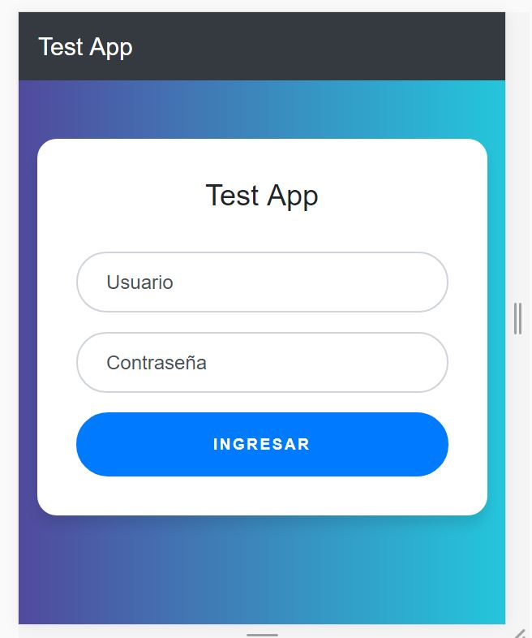

# Solución del reto técnico

# SERVER

> Para esta solución se realizo una API empleando la arquitectura DDD (domain driven design) implementada con NETCORE y  GraphQL. 
> Se utiliza GraphQL, para exponer el API, con fin de mostrar buenas practicas en el desarrollo de Api Rest.

## Para ejecutar el API

 1. Primero restaure la base de datos:  
	 2. **doc/db_agencies_test.back :** Contiene el back de la base de datos con estructura y los datos de prueba.
	 3. **doc/db_agencies_test_script.sql:** Contiene la estructura de la base de datos.
	 4. **Emigrar Entity Core:** Puede realizar emigración de la base de datos, creando una base de datos y cambiando el string de conexión en **server\Api.Test\Api.Test\Api.Test.Server\appsettings.Development.json** . Luego ubiquese en la ruta **server\Api.Test\Api.Test\Api.Test.Server** y ejecute el siguiente comando en una consola de comando **dotnet ef database update**
	 
 2. Arrancar el API
	 3. Ubíquese en en la raíz del proyecto e ejecute en una consola de comando: 
	`cd server\Api.Test\Api.Test\Api.Test.Server`
    `dotnet restore`
    `dotnet run`
    Ingrese la URL que le proporciono el ultimo comando en un navegador, le abrirá en modo debug de GraphQL para hacer pruebas al API sin necesidad de tener un cliente GraphQL (Este modo se puede puede apagar y quedaría como un API normal sin interfaz).
    
 ## Prueba de GraphQL

> Nota: se puede seleccionar los atributos que se deseen mostrar

 **Optine todas las agencias activas, con todos sus atributos**
 

    query GetAgencies{
      angencies
      {
        id
        name    
        city
        {
        	id
        	name
        }
        state
        {
        	id
        	name
        }
      }  
    }

 **Optine todas las agencias activas, con filtro ID ciudad**
 

    query GetAgenciesFilterIdCity{
      angencies(filterIdCity:2){   
        name    
        city
        {    
        	name
        }
        state
        {    	
        	name
        }
      }  
    }

**Optine todas las agencias activas, con filtro NOMBRE ciudad**

    query GetAgenciesFilterNameCity{
      angencies(filterNameCity:"Miami")
      {
      	id
        name 
        state
        {
        	id
        	name
        }
      }  
    }

**Obtiene las ciudades que pertenece a una agencia**

    query GetCitiesOfAgencies{
      citiesOfAgencies{
        id,
        name
      }
    }

# FRONT-END

> Esta solución se realizo en React.

## Para ejecutar el Proyecto

 1. Ubíquese en la raíz del proyecto e ingrese los siguientes comandos en una consola de comando :
	 2. **cd .\front-end\test-app**
	 3. **npm install**
	 4. **npm start**
	 
**Nota:** El usuario y contraseña son los mismos que se proporcionaron para consumir el servicio de autenticación de cognito, luego que se usa el mismo servicio para validar el usuario.

